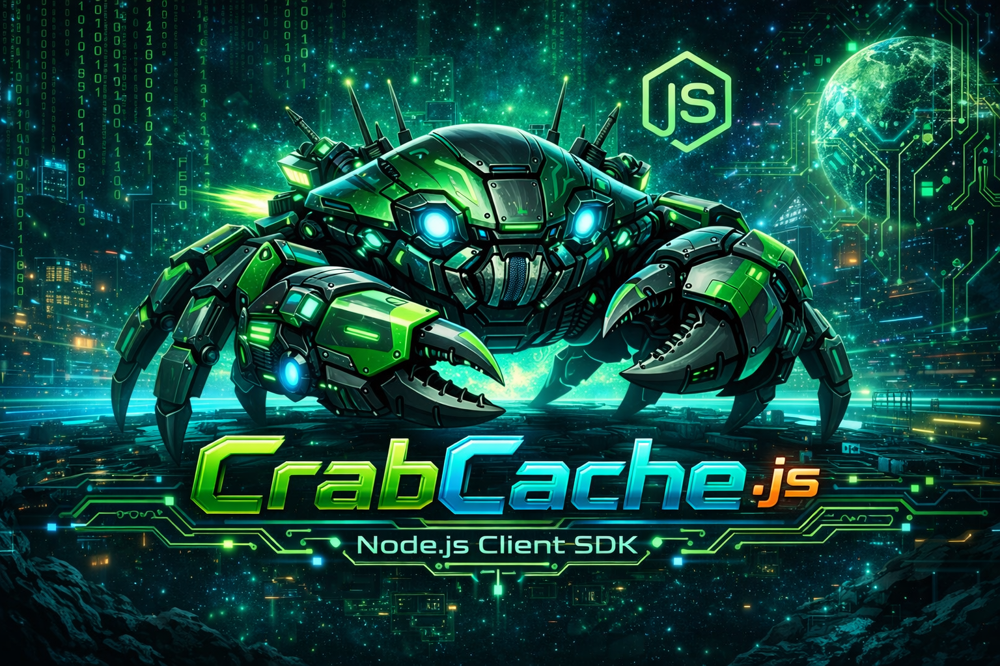

# 🦀 CrabCache Client para Node.js

<div align="center">
  
</div>

Cliente oficial Node.js para [CrabCache](https://github.com/RogerFelipeNsk/crabcache) - Sistema de cache moderno escrito em Rust com foco em performance e confiabilidade.

[](https://badge.fury.io/js/crabcache-client)
[](https://opensource.org/licenses/MIT)
[](https://nodejs.org/)

## 🚀 Características

- **Alta Performance**: Suporte a protocolo binário e pipelining
- **Pool de Conexões**: Gerenciamento inteligente de conexões TCP
- **TypeScript**: Tipagem completa para melhor experiência de desenvolvimento
- **Pipelining Avançado**: Execução em lote para máxima performance
- **Monitoramento**: Métricas detalhadas de cliente e servidor
- **Recuperação de Falhas**: Reconexão automática e health checks
- **Compatibilidade**: Suporte a protocolos texto e binário

## 📦 Instalação

```bash
npm install crabcache-client
```

ou

```bash
yarn add crabcache-client
```

## 🔧 Uso Básico

```javascript
const { CrabCacheClient } = require('crabcache-client');

async function exemplo() {
  // Criar cliente
  const client = new CrabCacheClient({
    host: 'localhost',
    port: 8000
  });

  try {
    // Conectar
    await client.connect();

    // Operações básicas
    await client.put('chave', 'valor');
    const valor = await client.get('chave');
    console.log(valor); // 'valor'

    // Com TTL
    await client.put('sessao', 'dados', 3600); // 1 hora

    // Remover
    await client.del('chave');

    // Ping
    const pong = await client.ping(); // 'PONG'

  } finally {
    await client.disconnect();
  }
}
```

## ⚡ Pipelining para Alta Performance

```javascript
async function pipelineExemplo() {
  const client = new CrabCacheClient();
  await client.connect();

  // Criar pipeline
  const pipeline = client.pipeline();
  
  // Adicionar múltiplos comandos
  pipeline
    .put('produto:1', JSON.stringify({ nome: 'Notebook', preco: 2500 }))
    .put('produto:2', JSON.stringify({ nome: 'Mouse', preco: 50 }))
    .get('produto:1')
    .get('produto:2')
    .ping();

  // Executar todos de uma vez
  const respostas = await pipeline.execute();
  
  console.log(`${respostas.length} comandos executados`);
  
  await client.disconnect();
}
```

## 🔬 Configuração Avançada

```javascript
const client = new CrabCacheClient({
  host: 'localhost',
  port: 8000,
  
  // Performance
  useBinaryProtocol: true,      // Protocolo binário (mais rápido)
  enablePipelining: true,       // Habilitar pipelining
  pipelineBatchSize: 100,       // Tamanho do lote
  
  // Pool de conexões
  poolSize: 20,                 // Máximo de conexões
  
  // Timeouts
  connectionTimeout: 5000,      // Timeout de conexão (ms)
  commandTimeout: 10000,        // Timeout de comando (ms)
  
  // Segurança (se habilitada no servidor)
  authToken: 'seu-token-aqui'
});
```

## 📊 Monitoramento e Métricas

```javascript
// Métricas do cliente
const clientMetrics = client.getClientMetrics();
console.log({
  totalRequests: clientMetrics.totalRequests,
  successRate: (clientMetrics.successfulRequests / clientMetrics.totalRequests) * 100,
  averageLatency: clientMetrics.averageLatency,
  pipelineRequests: clientMetrics.pipelineRequests
});

// Métricas do pool
const poolMetrics = client.getPoolMetrics();
console.log({
  activeConnections: poolMetrics.activeConnections,
  idleConnections: poolMetrics.idleConnections,
  poolHits: poolMetrics.poolHits,
  poolMisses: poolMetrics.poolMisses
});

// Estatísticas do servidor
const serverStats = await client.stats();
console.log(serverStats);

// Métricas do servidor  
const serverMetrics = await client.serverMetrics();
console.log(serverMetrics);
```

## 🎯 Comandos Suportados

| Comando | Descrição | Exemplo |
|---------|-----------|---------|
| `ping()` | Testa conectividade | `await client.ping()` |
| `put(key, value, ttl?)` | Armazena valor | `await client.put('chave', 'valor', 3600)` |
| `get(key)` | Recupera valor | `await client.get('chave')` |
| `del(key)` | Remove chave | `await client.del('chave')` |
| `expire(key, ttl)` | Define TTL | `await client.expire('chave', 300)` |
| `stats()` | Estatísticas do servidor | `await client.stats()` |
| `serverMetrics()` | Métricas do servidor | `await client.serverMetrics()` |

## 🚀 Pipelining Avançado

### Pipeline Básico

```javascript
const pipeline = client.pipeline();
pipeline
  .put('user:1', 'Alice')
  .put('user:2', 'Bob')
  .get('user:1')
  .get('user:2');

const results = await pipeline.execute();
```

### Pipeline em Lotes

```javascript
const pipeline = client.pipeline();

// Adicionar 1000 comandos
for (let i = 0; i < 1000; i++) {
  pipeline.put(`key:${i}`, `value:${i}`);
}

// Executar em lotes de 100
const results = await pipeline.executeBatched(100);
```

### Método Multi (Conveniência)

```javascript
const results = await client.multi([
  { command: 'PUT', args: ['key1', 'value1'] },
  { command: 'PUT', args: ['key2', 'value2'] },
  { command: 'GET', args: ['key1'] },
  { command: 'GET', args: ['key2'] }
]);
```

## 🔢 Trabalhando com Dados Binários

```javascript
// Armazenar dados binários
const binaryData = Buffer.from([0x48, 0x65, 0x6c, 0x6c, 0x6f]);
await client.put('binary:data', binaryData);

// Recuperar dados binários
const retrieved = await client.get('binary:data');
console.log(retrieved); // Buffer
```

## 🛡️ Tratamento de Erros

```javascript
try {
  await client.put('chave', 'valor');
} catch (error) {
  if (error.message.includes('timeout')) {
    console.log('Timeout na operação');
  } else if (error.message.includes('connection')) {
    console.log('Erro de conexão');
  } else {
    console.log('Erro desconhecido:', error.message);
  }
}
```

## 📝 Eventos

```javascript
client.on('connected', () => {
  console.log('Cliente conectado');
});

client.on('disconnected', () => {
  console.log('Cliente desconectado');
});

client.on('connectionError', (error) => {
  console.log('Erro de conexão:', error.message);
});

client.on('connectionCreated', () => {
  console.log('Nova conexão criada no pool');
});
```

## 🔧 Configuração do Servidor CrabCache

Certifique-se de que o servidor CrabCache está rodando:

```bash
# Via Docker
docker run -p 8000:8000 crabcache:latest

# Via código fonte
git clone https://github.com/RogerFelipeNsk/crabcache.git
cd crabcache
cargo run --release
```

## 📊 Benchmarks

Performance típica em ambiente de desenvolvimento:

```
Operações individuais:    ~15,000 ops/sec
Pipeline (lote de 10):    ~85,000 ops/sec  
Pipeline (lote de 100):   ~150,000 ops/sec
Protocolo binário:        ~20% mais rápido
```

## 🧪 Exemplos

Veja os exemplos completos na pasta `examples/`:

- [`basic.js`](examples/basic.js) - Uso básico do cliente
- [`pipeline.js`](examples/pipeline.js) - Pipelining para alta performance
- [`advanced.js`](examples/advanced.js) - Configuração avançada e monitoramento

```bash
# Executar exemplos
npm run example:basic
npm run example:pipeline
npm run example:advanced
```

## 🔧 Desenvolvimento

```bash
# Clonar repositório
git clone https://github.com/RogerFelipeNsk/crabcache-client-js.git
cd crabcache-client-js

# Instalar dependências
npm install

# Build
npm run build

# Testes
npm test

# Lint
npm run lint
```

## 📋 Requisitos

- Node.js >= 16.0.0
- CrabCache Server >= 1.0.0

## 🤝 Contribuindo

Contribuições são bem-vindas! Para contribuir:

1. Fork o projeto no [GitHub](https://github.com/RogerFelipeNsk/crabcache-client-js)
2. Crie uma branch para sua feature (`git checkout -b feature/AmazingFeature`)
3. Commit suas mudanças (`git commit -m 'Add some AmazingFeature'`)
4. Push para a branch (`git push origin feature/AmazingFeature`)
5. Abra um Pull Request

### Diretrizes para Contribuição

- Mantenha o código limpo e bem documentado
- Adicione testes para novas funcionalidades
- Siga as convenções de código existentes
- Atualize a documentação quando necessário

## 📄 Licença

Este projeto está licenciado sob a Licença MIT - veja o arquivo [LICENSE](LICENSE) para detalhes.

## 🙏 Agradecimentos

- [CrabCache Server](https://github.com/RogerFelipeNsk/crabcache) - O servidor de cache em Rust que torna tudo possível
- Comunidade Node.js e TypeScript
- Todos os contribuidores e usuários do projeto
- Comunidade Rust pela inspiração em performance

## 📞 Suporte e Contato

- **Issues**: [GitHub Issues](https://github.com/RogerFelipeNsk/crabcache-client-js/issues)
- **Autor**: Roger Felipe ([@RogerFelipeNsk](https://github.com/RogerFelipeNsk))
- **Email**: rogerfelipensk@gmail.com
- **Repositório Principal**: [CrabCache Server](https://github.com/RogerFelipeNsk/crabcache)
- **Documentação**: [CrabCache Docs](https://github.com/RogerFelipeNsk/crabcache/blob/main/README.md)

---

<div align="center">

**CrabCache Client** - *Cliente Node.js rápido e confiável para CrabCache* 🦀⚡

[](https://github.com/RogerFelipeNsk)
[](https://github.com/RogerFelipeNsk/crabcache)

</div>